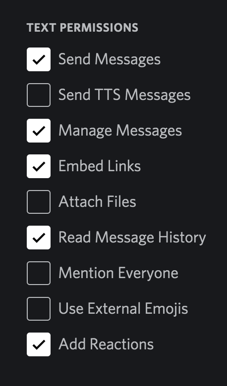

# cahbot

Run your discord bot for cards against humanity!
Based in https://github.com/SourMongoose/cah-bot

## Usage

https://top.gg/bot/429024440060215296

## Create a bot in discord

https://discordpy.readthedocs.io/en/latest/discord.html#discord-intro

Required scope: bot

Required permissions:



## Run the docker image

```
docker run \
       -dit \
       --name cahbot \
       -e DISCORD_LIVE_ID=<your-discord-bot-token-here>
       recuencojones/cahbot
```
